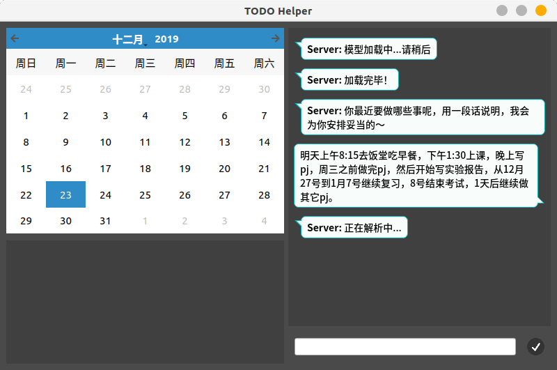

## 简介

输入自然语言，通过神经网络抽取时间成分，进行事务安排

任务解析方面运用了句法分析方法，时间解析方面运用了正则表达式匹配


## 运行环境与方法

* 运行环境：ubuntu 18.04   python3

* 训练好的神经网络模型：

  链接: https://pan.baidu.com/s/1qCObi-ItdHEkKle4_2dp3w  密码: cll8

  需要放在Model文件夹中

* 运行指令

  非UI方式启动：

  ```
  python3 Main.py
  ```

  UI方式启动：

  ```
  python3 App.py
  ```


## 效果展示

* * 启动时后台开始加载神经网络模型，需要一定时间

    

  * 用户从输入框中输入任务安排语句

    

  * 程序解析语句并展示提取的任务时间信息、更新日历

    

  * 用户可以连续输入多段任务安排，任务安排将在日历上累加；用户点击日历上的相应日期可以查看当前的待办任务

    

  * 用户可勾选已完成的任务，已完成的任务将在列表中消失，然后交互界面将产生任务已完成的信息

    

    

